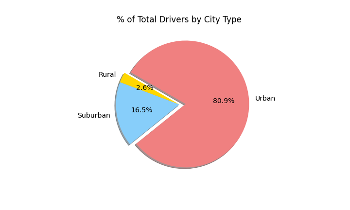

# PyBer_Analysis

## Project Overview

Analysis has been completed for PyBer comparing ride count, fare, and driver count rides occurring across three types of cities: urban,  suburban, and rural.

Measures of central tendency were calculated across all variables and the weekly fares across city types were shown in comparison on a multi-line graph.

These analyses were then used to provide three business recommendations. 

## Resources

### Data Sources 

city_data.csv

ride_data.csv

### Software 
* Python 3.7.6
	* Pandas
	* Matplotlib
	* Numpy
	* Scipy.stats
* Anaconda 4.10.1
	* Jupyter Notebook

## Results

The results of the analysis comparing city type with ride volume and fare can be shown below in the scatter plot. It should be noted that while the red dots (Urban rides) have a greater quantity, it is the rural cities that have the rides with the highest fare.

The Urban market cannot be undervalued,  however, as the following pie charts show the Urban cities as the prime contributor for not only ride counts, but driver count, and overall fares (even though the rural cities have a higher fare per ride, the volume of urban rides still make it the prominent contributor).

The multi-line chart compares all three city types and their fares over the course of quarter 1 of 2019. There are similar trends in the rise and fall of ride usage across the city types. The rural cities stay within the $0-$500 range per week, the suburban cities stay between $750 and $1500, but the urban cities stay almost entirely above $2000 each week.

## PyBer Analysis Summary

As the urban city-type has consistently shown the ability to bring in high revenue amounts, it can be recommended that PyBer maintain its presence in the urban market and expand into additional urban cities. 

Lastly, as the rural cities have the lowest amount of drivers, but the highest per ride fare, it should be considered to attempt to recruit additional drivers to the rural cities to capitalize on the higher fare rides. 

